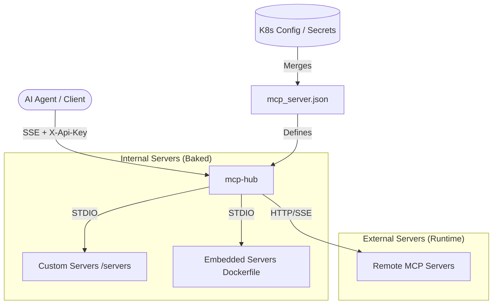

# mcp-hub

`mcp-hub` is a specialized centralized gateway designed to aggregate multiple **Model Context Protocol (MCP)** servers behind a single, authenticated SSE (Server-Sent Events) endpoint. It acts as a unified interface for AI agents to interact with a diverse ecosystem of tools and data sources.

Built on top of [`ptbsare/mcp-proxy-server`](https://github.com/ptbsare/mcp-proxy-server).

---

## 🏗 Architecture

The hub runs as a single containerized application, orchestrating several internal and external MCP servers simultaneously.

---

## 🔌 Server Integration Types

`mcp-hub` supports three distinct ways to integrate MCP servers:

### 1. External Servers (Online/Remote)
Used for servers that are already deployed and accessible over the network (HTTP/SSE).
- **Setup**: Configured at runtime via `mcp_server_extra.json`.
- **Latency**: Network-dependent.
- **Example**: A remote `n8n-executor` or a public MCP service.

### 2. Custom Servers (Local Development)
Used for bespoke servers developed specifically within this repository.
- **Location**: Found in the [`/servers`](./servers/) directory.
- **Setup**: Baked into the Docker image through the `Dockerfile`.
- **Communication**: Managed via **STDIO** for maximum performance and security.
- **Example**: [`freqtrade-mcp-server`](./servers/freqtrade-mcp-server/).

### 3. Embedded Servers (Third-Party Clones)
Used for existing public MCP servers that don't have a stable online endpoint or need to be "pinned" for stability.
- **Setup**: Cloned and installed directly into the image via the [`Dockerfile`](./Dockerfile).
- **Communication**: Managed via **STDIO**.
- **Example**: DexScreener, CryptoPanic, and other research tools sourced from external repositories.

---

## ⚙️ Configuration Management

The hub uses a **Config Merge Pattern** to allow for both static defaults and dynamic runtime updates without requiring a full image rebuild.

### The Merge Process
On every startup, the [`docker-entrypoint.sh`](./docker-entrypoint.sh) script performs a deep merge of:

1.  **`mcp_server.base.json`**: Compiled defaults baked into the image (Custom & Embedded servers).
2.  **`mcp_server_extra.json`**: Runtime additions or overrides provided via Kubernetes Secrets or ConfigMaps.

The resulting `mcp_server.json` is what the proxy server uses to initialize all connections.

---

## 🚀 Getting Started

### Adding a New Server

| Server Type | Procedure |
| :--- | :--- |
| **External** | Add the configuration to `mcp_server_extra.json` in your K8s Secret. |
| **Custom** | Create a new folder in `/servers`, implement the logic, and update the `Dockerfile` and `mcp_server.json`. |
| **Embedded** | Add a `git clone` and installation step to the `Dockerfile`, then reference it in `mcp_server.json`. |

### Security
All incoming requests to the hub must include an `X-Api-Key` header.
- **Admin UI**: Protected by basic auth (configured via `ADMIN_USERNAME/PASSWORD`).
- **MCP Endpoint**: `/sse`

---

## 🛠 Repository Structure

- [`/servers`](./servers/): Source code for custom MCP servers.
- [`Dockerfile`](./Dockerfile): Defines the hub environment, installs system dependencies, and builds internal servers.
- [`mcp_server.json`](./mcp_server.json): The default configuration for baked-in servers.
- [`docker-entrypoint.sh`](./docker-entrypoint.sh): Orchestrates the configuration merge and startup.

---

## 📝 License
Proprietary / Internal.
